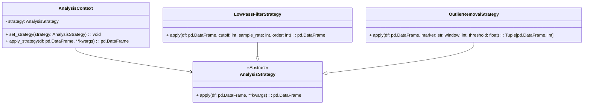

# **Low-Level Design Document for DataAnalysisPipeline**

## **1. Overview**
The `DataAnalysisPipeline` is a modular framework for ingesting, analyzing, and visualizing data. The pipeline includes three main components:
- **Data Ingestion Module**: Handles loading data from various formats using the Factory pattern.
- **Analysis Module**: Applies calculations and transformations using the Strategy pattern.
- **Visualization Module**: Plots the data using customizable visualizations with the Decorator pattern.

## **2. Motivation**
Gait analysis is essential in biomechanics,  it aids in the understanding of conditions like motor impairments and prosthetic design and usage. Motion capture systems like Vicon Nexus provide precise 3D tracking of markers on the body, offering critical insights into movement patterns, such as the positions of toes and heels during a walking segment. The development of our motion capture data analysis pipeline for investigating the effect of the stiffness of robotic ankle-foot prosthesis emulators offers significant potential to enhance prosthesis design and clinical outcomes for individuals with below-knee amputations.

`DataAnalysisPipeline` addresses the need to translate raw data into actionable insights by automating the calculation of key metrics, such as the Symmetry Index and Step Length Average, and visualizing results for easy interpretation. By enabling precise analysis of gait dynamics, the pipeline helps evaluate the impact of prosthesis stiffness on achieving step symmetry, a critical goal associated with improved comfort, reduced energy expenditure, and long-term musculoskeletal health. This work bridges engineering and clinical practice, providing actionable insights to optimize prostheses for individual users. Furthermore, by streamlining data processing, the project promotes accessibility and modularity, contributing to more scalable and repeatable analysis results.

## **3. Directory Structure**

```plaintext
DataAnalysisPipeline/
├── data_analysis_pipeline
│   ├── analysis_module
│   ├── data_ingest_module
│   └── visualization_module
├── main.py
├── requirements.txt
├── setup.py
└── tests
```

## **4. Module Design**

### **4.1 Data Ingestion Module**
**Responsibilities**
- Load data from multiple file types.
- Use the Factory pattern to dynamically instantiate appropriate loaders.

**Class Diagram**


**Classes**
- `DataLoader` (Abstract Base Class)
    - Defines the interface for all loaders
- `CSVLoader` (Concrete Implementation)
    - Implements `load()` for `.csv` files
    - Parses through headers to assign new data frame column names
    - Drops all `NaN` values
- `LoaderFactory` (Factory Class)
    - Instantiates data loaders based on the input file type

**Example Usage**
```
    factory = DataLoaderFactory()

    csv_loader = factory.create_data_loader(
        base_path="/home/<USER>/MoCap_data",
        subject_name="P06",
        condition_name="Optimal",
        file_format="csv"
    )

    data, headers = csv_loader.load()
```

### **4.2 Data Analysis Module**
**Responsibilities**
- Perform data analysis using various strategies.
- Capable of extending functionality by adding new analysis algorithms.

**Class Diagram**


**Classes**
- `AnalysisStrategy` (Abstract Base Class)
    - Encapsulates an analysis algorithm
- `AnalysisContext` 
    - Manages different analysis strategies
    - `set_strategy(strategy: AnalysisStrategy)`: Sets the current strategy
    - `apply_strategy(df: pd.DataFrame, **kwargs)`: Applies the current strategy
- `LowPassFilterStrategy ` (Concrete Strategy)
    - Applies a low pass butterworth filter to the data
- `OutlierRemovalStrategy` (Concrete Strategy)
    - Removes outliers based on a standard deviation threshold

**Example Usage**
```
context = AnalysisContext(strategy=LowPassFilterStrategy())
filtered_data = context.apply_strategy(data, cutoff=10, sample_rate=100, order=4)

context.set_strategy(OutlierRemovalStrategy())
cleaned_data, num_outliers = context.apply_strategy(filtered_data, marker=<MARKERNAME>, window=50, threshold=3)
```
### **4.3 Visualization Module**
**Responsibilities**
- Generate visualizations for analyzed data.
- Enhance plots with additional features using the Decorator pattern.

**Class Diagram**


**Classes**
- `VisualizationDecorator ` (Abstract Base Class)
    - `apply(df: pd.DataFrame, **kwargs)`: Delegates the call to the wrapped strategy
- `PlotDecorator ` (Decorator)
    - Adds plotting functionality to an analysis strategy

## **5. Future Work**
1. Add support for additional file formats (e.g. `.xdf`, `.mat`)
2. Create a more dynamic and robust approach to parsing headers in `.csv` files
3. Include data export module
4. Implement functionality for streaming data ingestion and real-time analysis for gait assessments during sessions

## **6. Appendix**

### **6.1 Vicon Nexus Data Cleaning Procedure**
#### 1. Reconstructing Marker Trajectories
Rebuild 3D trajectories from raw 2D data captured by cameras
1. Open Trial Data
2. Run the Reconstruction Pipeline: Use the Reconstruct function in the Pipeline Tools.
3. Inspect Reconstructed Markers: Check the reconstructed trajectories in the 3D Perspective view. Look for missing markers or discontinuities in the trajectory.

#### 2. Labeling Markers
#### Assign appropriate labels to the reconstructed markers for consistent analysis (left toe, left heel, right toe, right heel)
1. Select subject labeling template
2. Manually Adjust Labels: In labeling mode, manually assign correct labels to markers.
3. Check for Missing Labels: identify unlabeled markers, delete if extra or relabel with correct identity.

#### 3. Gap Filling
#### Address any gaps in the labeled trajectories
1. Identify Gaps: Open the Graph View to visualize marker trajectories over time.
2. Use Gap Filling Tools: Apply the gap-filling method from the Pipeline Tools

### **6.2 Vicon Nexus Data Export Doc**

#### Exporting the Cleaned Data 
1. Navigate to Pipeline Tools and select Export file in the desired format (e.g, Export CSV. file).
2. Validate data on new file. 

### **6.3 Human Subject Experiment**


The image above shows a participant during the walking experiment. A marker is placed on the heel and toe of her intact right foot, along with a marker on the heel and toe of the robotic ankle-foot prosthesis end-effector.

